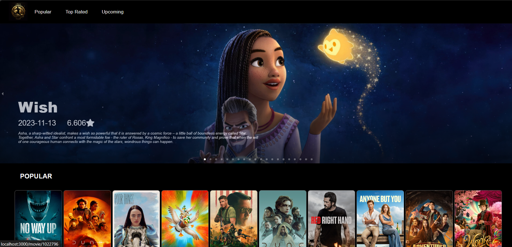

# FlixScore

FlixScore is a web application built using React.js that provides information about popular and upcoming movies along with ratings. The project aims to offer a great user interface for users to explore and discover their favorite movies.

## Features

- View a list of popular movies with details
- Explore upcoming movie releases
- Ratings for each movie to help users make informed choices
- User-friendly interface for seamless navigation

## Technologies Used

- React.js
- HTML
- CSS
- JavaScript
- API integration for movie data
- TMDb (The Movie Database) for movie information

## Getting Started

Follow these steps to get a copy of the project up and running on your local machine.

1. Clone the repository:

```bash
git clone https://github.com/Rush9970/flixscore.git
cd flixscore
```

